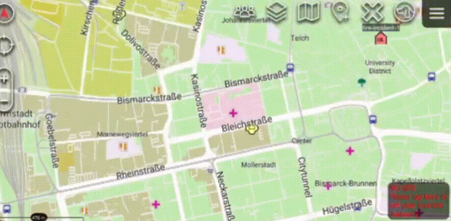

# ATAK Simulator: A Python CoT Protocol Demonstrator


The **Android Team Awareness Kit (ATAK)**, for civilian use, or **Android Tactical Assault Kit (ATAK)** for military use, is a geospatial collaboration tool that enables situational awareness through real-time map-based information sharing.  

This project is a **proof-of-concept simulator** written in Python that demonstrates how to generate and send **real-time fake location data** to an ATAK client using the **Cursor on Target (CoT)** protocol.  


## 🚀 Features  

- **Clean Architecture** – Built with the **MVC design pattern** to separate logic, control, and presentation.  
- **Object-Oriented Design** – Each entity (e.g., fire truck, fire incident) is modeled as an independent object for future customizable properties.  
- **Asynchronous Processing** – Uses Python’s `asyncio` for non-blocking simulation and communication.  
- **CoT Protocol Integration** – Leverages [PyTAK](https://pytak.readthedocs.io) to generate industry-standard CoT XML messages.  
- **Accurate Geospatial Calculations** – Powered by `geographiclib.geodesic` for distance and bearing computations.  


## 🛠 Setup  

1. Install required system dependencies:  
   ```
   sudo apt install libffi-dev
   ```

2. Clone the repository and create a virtual environment:
    ```
    git clone https://github.com/your-username/atak-simulator.git
    cd atak-simulator
    python3 -m venv venv
    source venv/bin/activate
    ```
3. Install Python dependencies:

    ```
    pip install -r requirements.txt
    ```


## ▶️ Usage
Run the simulator with:
```
python main.py
```

- A fire incident marker and two fire truck markers will appear on your ATAK client map.

- The trucks will move along a predefined path toward the incident, sending CoT updates every 0.5 second.



Stop the simulation with `Ctrl+C` in your terminal.


## 🏗 System Architecture

The simulation is structured according to the MVC design pattern:

* **Model (`model/`)**: This layer is the heart of the simulation. It contains the data and business logic, including the `Marker` classes (`FireIncident`, `FireTruck`) and the `SimulationManager` that handles marker creation and position updates.

* **Controller (`controller/`)**: This is the coordination layer. It receives commands to start and stop the simulation, interacts with the `SimulationManager` to update data, and uses a network utility to send the data to the ATAK client. It acts as the bridge between the Model and other sections.

* **Utilities (`utils/`)**: This module contains helper functions, such as the `generator_cot_xml` function for converting model objects into CoT XML, and the `MySender` class for managing the network queue.


## 🧰 Troubleshooting

Check the ATAK client can be reached by the host.
In default config, the ATAK client should also open unicast TCP ports 4242 and 8087, which should show up as 'open' when executing ```nmap [ATAK client IP]``` on the host.


## 🔮 Future Improvements

This project serves as a strong foundation. Potential future improvements include:

* **Graphical User Interface (GUI):** Implement a simple UI with "Start" and "Stop" buttons, and controls for the simulation speed.
* **Dynamic Routing:** Use a library like `OSMPythonTools` to find and simulate movement along actual road networks. The current use of `geographiclib.geodesic` is a solid first step towards this goal.
* **Realistic Behavior:** Add more complex logic for vehicle behavior, such as speeding up, slowing down, or responding to new incidents.
